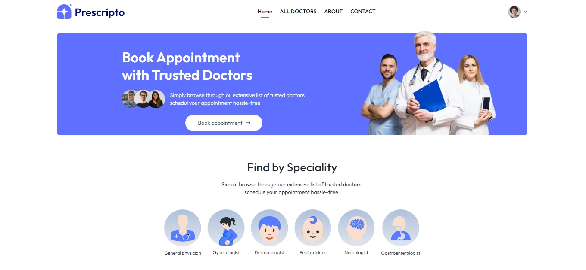
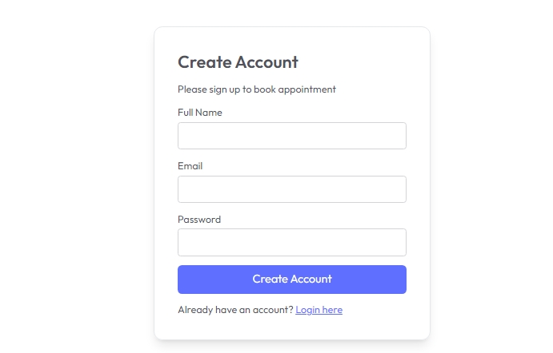
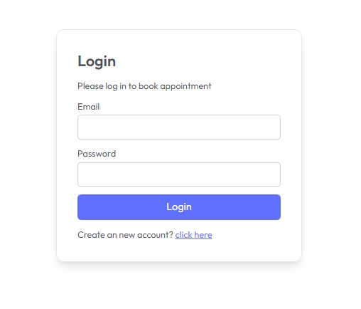
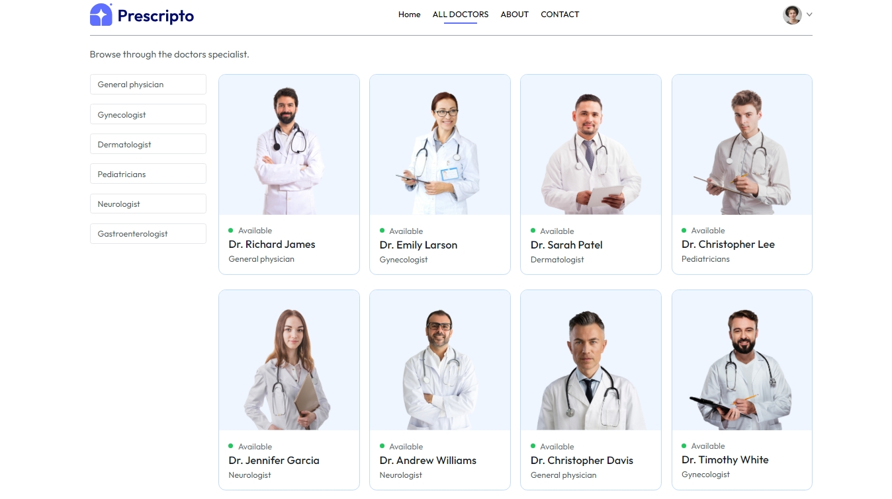
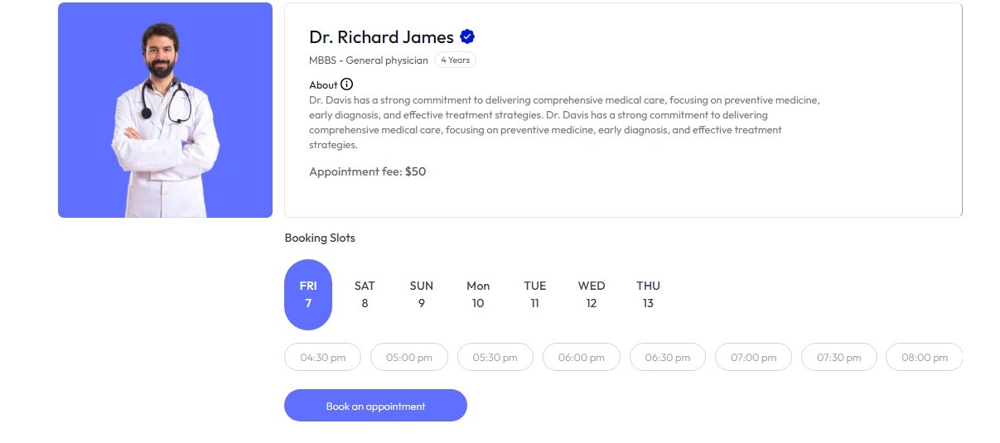

# **docEase** - Doctor-Appointment-Platform

DocEase is a frontend web app for booking doctor appointments. Users can search specialists, view doctor profiles, and manage bookings. Admins can approve or reject appointments. Built with React.js and Tailwind CSS.

## **Key Features**

### For Visitors:
- **Create Account/Login**: Register or log in to access the system
- **Search for Specialists**: DFind doctors based on their specialty.
- **View Doctor Details**: See information about doctors before booking.
- **Book Appointments**: Check appointment details and cancel if needed.
- **View and Cancel Appointments**: Create a profile, view your appointment date, and cancel it if needed.

## **For Admins**

- **Manage Appointments**: View and handle all bookings.
- **Accept or Reject Appointments**: Approve or decline appointment requests.

---
## **Methodology**
This project follows a component-based architecture using React.js. It uses React Router for navigation, Axios for API requests, and Tailwind CSS for styling. The application maintains state using React's built-in useState and useContext hooks.

---

## **Tech Stack**

### Frontend:
- React.js
- Tailwind CSS

### Packages:
- React Router Dom (for client-side routing)
- Axios (for handling HTTP requests)
- React Toastify (for notifications)
- Vite (for fast development and build optimization)

### State Management:
- React useState and useContext hooks are used for managing state efficiently across components.

---

## **Limitations**
- No backend is implemented yet.
- No payment integration included yet.

---

## **Demonstration**

This project showcases a fully functional doctor appointment booking system with distinct functionalities for users and admins.

### Screenshots

#### 1. Homepage

The homepage provides an overview of available doctors and services

#### 2. Registration Page

Users can create accounts by filling out the registration form.

#### 3. Login Page

Users can log in to manage their appointments.

#### 4. Doctor Listings

Browse available doctors and check their specialties..

#### 5.  Booking an Appointment

Choose your doctor and confirm your appointment.

---

## 🌟 You've Made It This Far!

Wow, that's fantastic! Thank you so much for your interest and support.

If you’ve enjoyed working with this project, a ⭐️ would be greatly appreciated. Your support motivates me to keep improving and working on more projects.

Feel free to share any advice or feedback—I’d love to hear from you!
---

Once again, thank you for your encouragement! 😊
